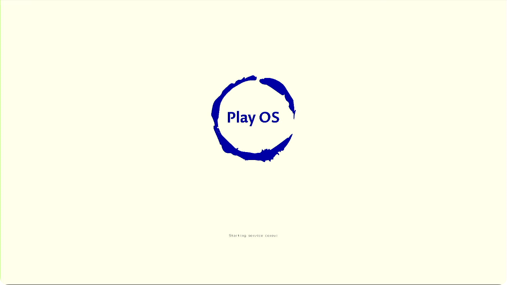
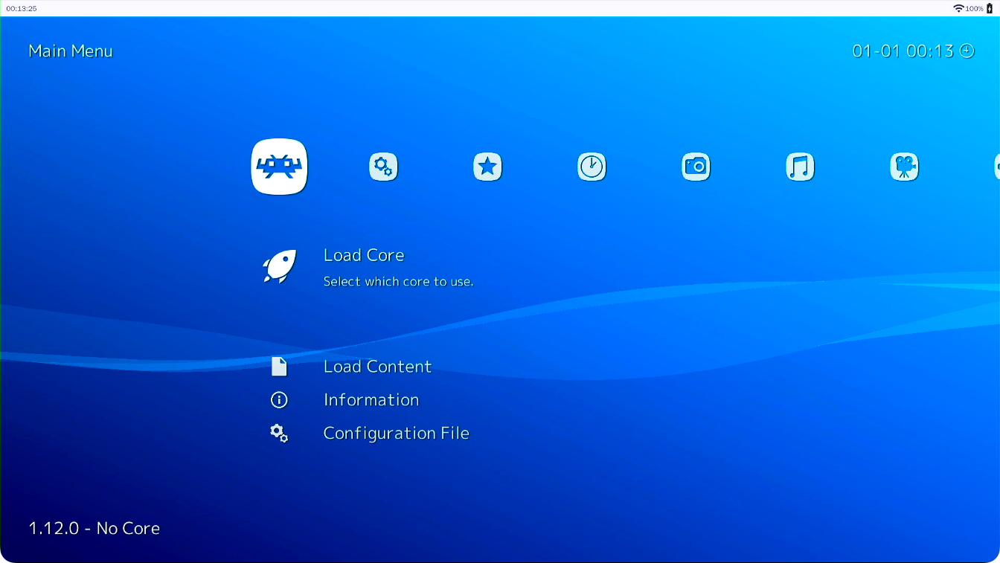
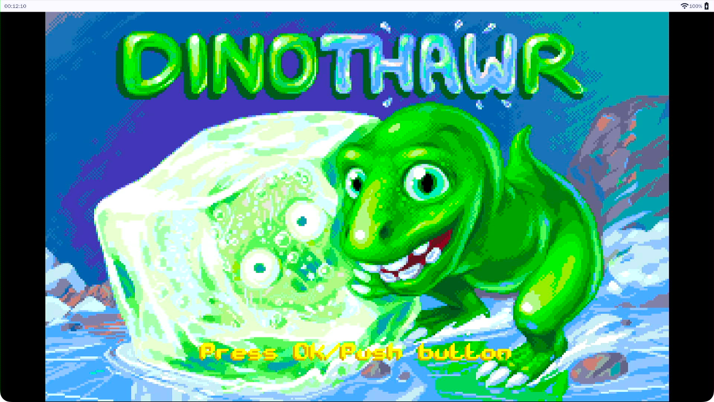

# Play OS

Play OS is a Linux distribution built on Yocto. It use `OpenRC` as init process, and have it's own GUI environment [PlayOS CoreUI](https://github.com/OS-Play/playos-coreui). Now, Play OS use RetroArch as a home screen, you can play the retro games on it.

## Development environment
Play OS is building on Yocto, you can refer to Yocto document "[System Requirements](https://docs.yoctoproject.org/4.0.4/ref-manual/system-requirements.html)" for setup your system.

## Get source code
First, install git-repo tool: [git-repo](https://gerrit.googlesource.com/git-repo) or [https://mirrors.tuna.tsinghua.edu.cn/help/git-repo/](https://mirrors.tuna.tsinghua.edu.cn/help/git-repo/)

Then, sync the source code by following commands:

```bash
mkdir playos && cd playos
repo init -u https://github.com/OS-Play/manifests
repo sync
```

## Build
Now, you can setup the environment, and build the `playos-image`.

```bash
source scripts/envsetup.sh

bitbake playos-image
```
Note: The image is built for `khadas vim1` by default.

## Screenshots





